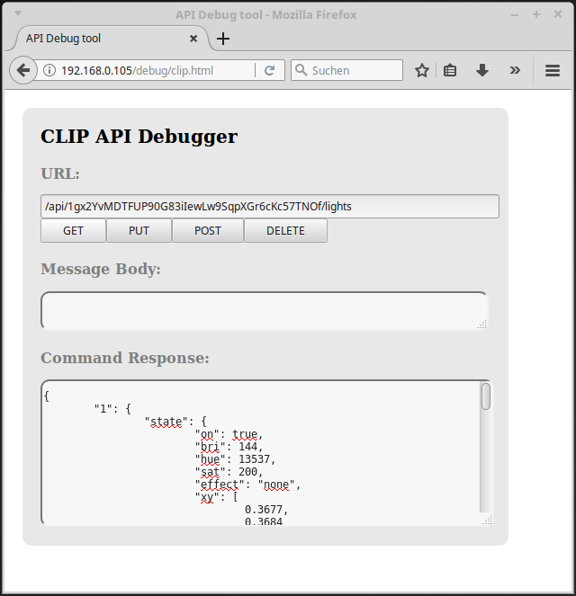

# hue on zeptrionAir


To control my light at home, I still prefer my switch on the wall.
However, in the beautiful new world, unfortunately I need two switches to control my light. Now I have discovered zeptrionAir, which exactly solves my demand to control the light with one switch.

To use this, a little configuration is needed.

## Configuration Steps
First make sure you have the zeptrionAir-switch and the hue-light connected whit your home network.

### Step 1
Visit the following address with your web browser.

```
http://<hue-bridge ip address>/debug/clip.html
```

You should see an interface like this.


### Step 2
We need to use the randomly generated username that the hue-bridge creates for you. Fill in the info below, go and press the button on the bridge and then press the POST button.

##### URL
```
POST
/api
```

##### Body
``` json
{"devicetype":"my_hue_app#zeptrionAir"}
```


### Step 3

Okay now that we have a username with permission to use the system fill in the info below and press the GET button. In the Cammand Response field you should see all your lights.

##### URL
```
GET:
api/<your randomly generated username>/lights
```



### Step 4
For the next step you need a Rest-Client. In this example I use the Insomnia Rest-Client (https://insomnia.rest/).
Create with your Rest-Client a new POST request with the URL and Body below.

##### URL
```
POST:
http://<zeptrionAir ip address>/zapi/smartbt/prgm
```
##### Body
``` json
{"on":true, "ntm":120}
```

After pressing the Send button, the zeptrionAir device is in programming mode.


### Step 5
Now create a GET request with the URL below it.

##### URL
```
GET:
http://<zeptrionAir ip address>/zapi/smartbt/prgn
```

All buttons on which web-services can be deposited (SmartButtons) should blink after this service. Now press a blinking button in the next 120 seconds to control the hue-lights.


### Step 5
As a last step we have to POST a web-service on the button with a web-service (see URL and body below). Sounds twisted but it is not so worst.

You can just copy and past the URL... but you have to adjust the body with your own parameters.
In the Body example, four web-services are configured. One zeptrionAir-service and three hue-services. This happen, with four entrys in a json array. The first json entry is a service for the zeptrionAir-switch itself. It ensures that the relay is switched and that the hue-light is supplied with electricity. The other services are philips-hue services for each light. For more informations check out https://www.developers.meethue.com/philips-hue-api.

More information about the prgs-json can be found at the end of this chapter.

##### URL
```
POST:
http://<zeptrionAir ip address>/zapi/smartbt/prgs
```

##### Body
``` json
[
{
"req": "POST",
"typ": "application/x-www-form-urlencoded",
"loc": "localhost",
"pth": "/zrap/chctrl",
"bdy": "cmd1=on"
},
{
"req": "PUT",
"typ": "application/json",
"loc": "192.168.0.105",
"pth": "/api/1gx2YvMDTFUP90G83iIewLw9SqpXGr6cKc57TNOf/lights/1/state",
"bdy": "{\"on\":true,\"hue\":13537,\"sat\":200,\"bri\":144}"
},
{
"pth": "/api/1gx2YvMDTFUP90G83iIewLw9SqpXGr6cKc57TNOf/lights/2/state"
},
{
"pth": "/api/1gx2YvMDTFUP90G83iIewLw9SqpXGr6cKc57TNOf/lights/3/state"
}
]
```


##### Rules of interpretation


1. Each dictionary describes a web-service if at least one of the keys exists: <b>```"url"```</b>,<b>```"loc"```</b>,<b>```"sn"```</b> or <b>```"pth"```</b>.
2. Optimization: If a key is missing for a web-service, its value is taken from the previous array element or the default.
3. With the special location <b>```"loc":"*"```</b> you can send a web-service to all currently available MDNS hosts.
4. With <b>```"hdr"```</b> you can add additional lines to the HTTP header. But you have to end each line with <b>```""\r\n"```</b>!
5. With <b>```"dns":"mdns"```</b> the hostname list is updated via MDNS before continuing with the next dictionary.
6. With <b>```"dns":"dns"```</b> the next <b>```"loc"```</b> address is transformed into an IP address by DNS lookup.

###### Terms and valid JSON-Keys

| Key | Description      | Default                             |  Other examples                                    |
|-----|:----------------:|:-----------------------------------:|:--------------------------------------------------:|
| req |  request-method  | "POST"                              | "GET", "PUT"                                       |
| loc |  location        |                                     | "zapp-12345678", "192.168.0.1"                     |
| sn  |  serial number   |                                     | "12345678"                                         |
| pth |  path            |                                     | "/zrap/chdes", "/zrap/chctrl/ch1"                  |
| prt |  TCP port        | "80"                                |  "65535"                                           |
| typ |  content-type    | "application/x-www-form-urlencoded" | "application/json"                                 |
| hdr |  HTTP headers    |                                     | "User-Agent: zApp\r\n" ("\r\n" after each line!!!) |
| bdy |  body            |                                     | "cmd1=toggle"                                      |
| dns |  DNS update      |                                     | "mdns", "dns"                                      |


### Step 6
have fun!
